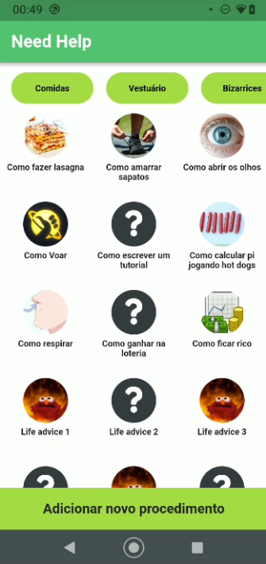
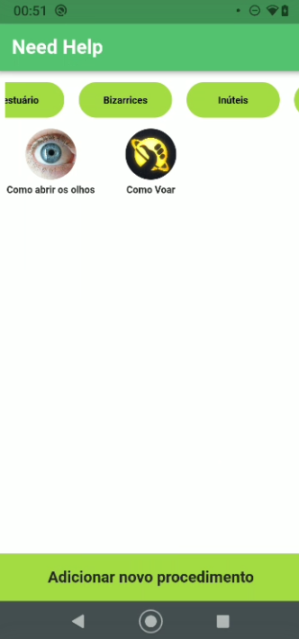
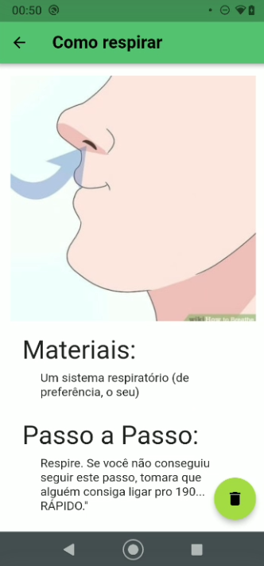
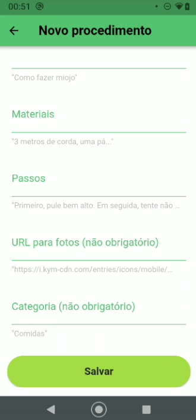

# fiap-grupoj-fase2

Repositório para entrega da atividade da fase 2 do MBA de Full Stack Development da FIAP, grupo J da turma MBA5SCJO.

## Need Help App

Com base em sites como o WikiHow e canais do youtube como o "Dad, how do I...", foi criado este protótipo: um app para criar e manter tutoriais para ações e coisas do dia a dia. Abaixo temos as telas da aplicação e explicações acerca de seu funcionamento.

### Home Screen

Na tela principal, temos diversos tutoriais pré-carregados na aplicação, junto com suas respectivas categorias (na aplicação produtiva, o usuário inicialmente não teria tutoriais já prontos, mas, para fins de demonstração, neste protótipo já estarão prontos alguns).

Na barra superior, temos um  scroll horizontal com as categorias presentes nos tutoriais. Ela é dinamicamente modificada de acordo com os tutoriais presentes no banco SQFLite usado. Na parte central da tela, temos os tutoriais, que são botões clicáveis. E na parte debaixo, temos um botão para criar novos tutoriais.

  

Ao clicar nos botões de categorias, os tutoriais podem ser filtrados, como mostrado abaixo:

  

E, ao clicar em cada tutorial é aberta uma nova tela.

### Tutorial Screen

A tela aberta ao clicar em um tutorial é uma tela com as informações daquele tutorial. Nesta tela, a única ação atualmente é a exclusão do tutorial presente.

  

### Info Screen

Ao clicar no botão "Adicionar novo procedimento" da tela principal, é aberta a tela a seguir:

  

  

Nesta tela é possível criar um novo tutorial, preenchendo os campos de acordo com as informações desejadas (tendo em mente os exemplos escritos como hints).

### Easter Egg

Como dito anteriormente, esta versão da aplicação já vem com alguns tutoriais carregados. Com isso em mente, foi criado um mecanismo para retornar a aplicação a este estado inicial (com todos os tutoriais iniciais e sem quaisquer outros criados posteriormente). Para isto, basta dar um duplo toque sobre o nome da aplicação no canto superior esquerdo da tela principal.
